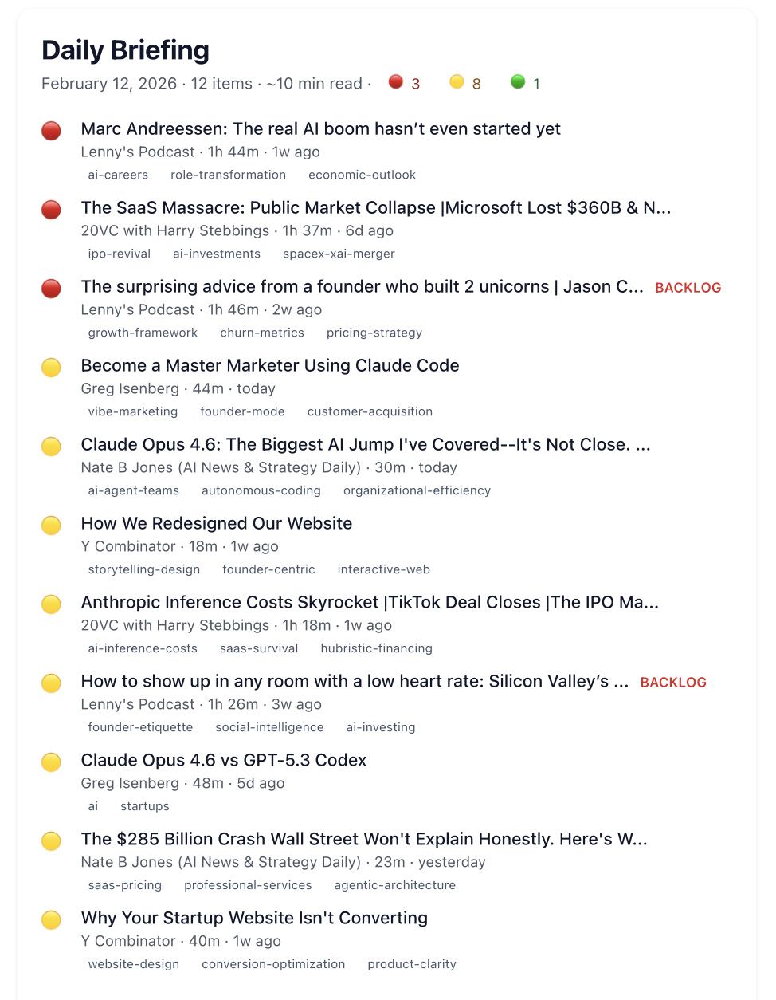
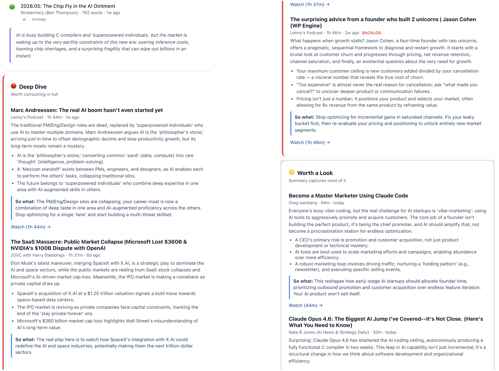

# Daily Briefing Tool

**I built a system that reads 900+ pieces of content so I don't have to.**

I follow 8 sources across AI, startups, strategy, and finance — from 3-hour Dwarkesh Patel interviews to 700-word Stratechery newsletters. I had a 6-month backlog and maybe 5 minutes each morning. So I built a pipeline that fetches everything, sends it through LLMs, decides what's worth my time, and delivers a daily email I can scan over coffee.

This was built entirely using [Claude Code](https://claude.ai/claude-code) over 10 iterative sessions. I'm a product manager — the code was written by Claude; the product decisions, prompt engineering, and system design were mine.

## What It Actually Does

Every morning, I get an email with two layers:

**Layer 1 — Headline Index (30-second scan).** Tier indicators, titles, sources, lengths, and topic tags. I scan this over coffee and already know what kind of day it is.

<p align="center">
  
</p>

**Layer 2 — Detail Cards (5-minute read).** Summaries, key insights, and opinionated "so what" takes — tiered by how much value the original adds beyond the summary.

<p align="center">
  
</p>

The tier system is the core product decision: not everything deserves the same attention. A **Deep Dive** means "the summary only captures half the value — go watch/read the original." A **Summary Sufficient** means "you've got the gist, move on." This saves me hours per week.

## The Product Decisions That Matter

**Why tiers instead of scores?** A 1-10 score is meaningless. What I actually need to know is: "can I skip the original?" Three tiers answer that directly. And because LLMs tend to rate everything as "worth a look," I built a calibration layer that overrides the LLM based on word count, source reputation, and content type.

**Why a blacklist system?** LLMs produce recognizable slop — "game-changer," "paradigm shift," "leveraging AI." I tell the LLM to avoid these in the prompt, but it ignores that instruction ~20% of the time. So there's a post-processing regex layer that catches and replaces anything that slips through. Two layers, zero tolerance.

**Why source diversity caps?** Without them, a prolific source (20VC publishes daily) would dominate every briefing. Max 2 items per source, with an exception for a 3rd if it's rated deep dive. This forces variety.

**Why dynamic topic tags instead of fixed categories?** Early versions used fixed buckets (AI, Finance, Startups, Strategy). They were too generic to be useful. Now the LLM generates specific tags like "vibe-coding," "GPU-capex," "MSFT" — tags that help me decide in one glance whether to pay attention.

## How It Works

```
fetch → process → compose → send-briefing
```

1. **Fetch** — YouTube Data API discovers videos, transcripts are extracted, RSS feeds are parsed. Everything goes into SQLite.
2. **Process** — Each item hits Gemini 2.5 Flash (with OpenAI GPT-4o as automatic fallback). The prompt enforces a specific voice, variety rules, and structural constraints. Post-processing applies blacklist enforcement and signal-based tier calibration.
3. **Compose** — Selects ~15 items (18 hard cap) with source diversity, deep dive ceiling (max 3), priority ordering, and fresh/backlog mixing.
4. **Send** — Generates an editorial intro, composes a two-layer HTML email, sends via Gmail SMTP to multiple recipients, saves a backup.

## Results

- **912 content items** fetched from 8 sources (Jan 2025 — present)
- **874 items processed** through LLMs (659 via Gemini, 209 via OpenAI)
- **Tier distribution:** ~30% deep dive, ~58% worth a look, ~12% summary sufficient
- **Daily briefings delivered** with 12-15 items each, mixing fresh content with backlog
- **Fully automated** — runs every morning via macOS launchd, no terminal required
- **Full backlog processed** in ~30 minutes using concurrent dual-provider processing

What was a 6-month backlog I'd never clear is now a 5-minute morning email.

## Setup & Usage

### Quick Start

```bash
git clone https://github.com/Sukrit-bit/daily-briefing-tool.git
cd daily-briefing-tool

python3 -m venv venv
source venv/bin/activate
pip install -r requirements.txt

cp .env.example .env    # Add your API keys
python -m src.cli init-db
```

### Automate It (macOS)

The included launchd configuration runs the full pipeline every morning at 7 AM — no terminal required.

```bash
# Edit the plist to set your project path, then:
cp com.sukrit.daily-briefing.plist ~/Library/LaunchAgents/
launchctl load ~/Library/LaunchAgents/com.sukrit.daily-briefing.plist
```

**One-time setup:** Grant Full Disk Access to `/bin/bash` in System Settings > Privacy & Security (required because the project lives in `~/Documents`). If your Mac is asleep at 7 AM, launchd runs the job when it wakes.

Logs: `data/logs/briefing_YYYY-MM-DD.log`

### Manual Workflow

```bash
python -m src.cli fetch --all              # Fetch new content
python -m src.cli process --all --delay 5  # Process through LLM
python -m src.cli compose --preview        # Preview in browser
python -m src.cli send-briefing            # Send the email
```

## Sources

| Source | Type | Focus |
|--------|------|-------|
| Nate B Jones | YouTube | AI news & strategy |
| Greg Isenberg | YouTube | Startups, building in public |
| Y Combinator | YouTube | Startup advice, founder interviews |
| Dwarkesh Patel | YouTube | Deep technical interviews (1-3h) |
| Lenny's Podcast | YouTube | Product, startups, strategy |
| 20VC (Harry Stebbings) | YouTube | VC/founder interviews |
| BG2 Pod | YouTube | Finance, AI, strategy |
| Stratechery | RSS | Strategy & tech analysis (free articles) |

Sources are defined in `config/sources.yaml`. Adding a new one is a YAML edit + a `fetch` command.

## What I'd Build Next

- **Web UI** — Browse past briefings, flag bad summaries, search across content. Right now there's no way to tell the system "this summary missed the point." A feedback loop would let me improve prompt engineering based on real failures, not guesswork.

- **Feedback loop** — Use flagged summaries to build a dataset of what good and bad looks like, then fine-tune prompt engineering against it. This closes the gap between "works most of the time" and "works reliably."

- **If I were building this for others** — The composition algorithm (source diversity, tier calibration, backlog clearing) generalizes well beyond my 8 sources. The main gap is onboarding: users would need a flow to add their own sources, set tier thresholds, and define what "slop" means for their domain. The email works, but a web-based reading experience would let users interact with the content instead of just scanning it.

## Built With

[Claude Code](https://claude.ai/claude-code) (all code) · Gemini 2.5 Flash (primary LLM) · OpenAI GPT-4o (fallback) · Gmail SMTP (email) · SQLite · Python

---

*See [PRD.md](PRD.md) for the full product design document — the problem framing, tradeoff decisions, architecture, and prompt engineering behind this system.*

*See [TECHNICAL.md](TECHNICAL.md) for architecture decisions, edge cases, and engineering tradeoffs.*

*See [PROMPT.md](PROMPT.md) for the exact LLM prompt — the most iterated artifact in the project.*
